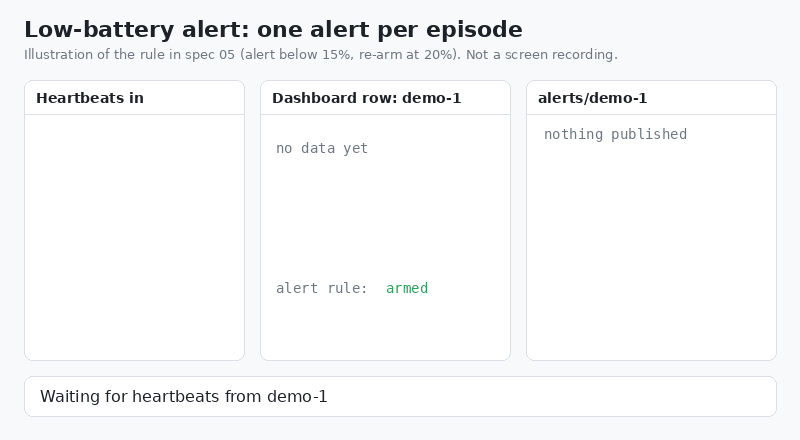
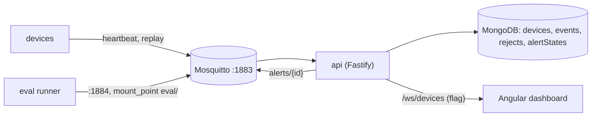

# Beaconyard

Devices send heartbeats over MQTT. Beaconyard stores them, shows them on a live dashboard, and sends one alert when a battery gets low. I built it one spec at a time with Claude Code.

Each device has a current state and a full history in MongoDB. Devices can go offline, save up their heartbeats, and send them all at once when they reconnect. Duplicates and messages that show up out of order don't change the result.

I built this to practice the job I'm applying for. That job is mostly writing specs for a coding agent, directing it, and checking its work, not writing the code by hand. Claude Code wrote almost all of the code here. My part was deciding what each spec required, what the agent wasn't allowed to decide on its own, and what counted as done. I reviewed every plan before any code got written, and I kept a log of what my reviews caught.

<p align="center">
  
</p>

_A device drops below 15%. The row updates on every heartbeat, but the alert only fires once._

## If you only have a couple minutes

- [REVIEW-LOG.md](REVIEW-LOG.md): 14 entries across five specs. Misses, wins, and two checks that didn't find anything. Each one says what caught it and what I changed.
- [specs/05-low-battery-alert.md](specs/05-low-battery-alert.md): what the agent actually got for the alert feature. The clarifications at the bottom came out of plan review.
- [PR #6](https://github.com/trentschnee/beaconyard/pull/6): my review notes for the alert, including a "bug" that turned out to be the system doing the right thing with a late message.

## Run it

You'll need Node 22, pnpm (through corepack), and Docker.

```bash
docker compose up -d                       # Mosquitto on 1883 (1884 for evals), Mongo on 27017
pnpm install
DASHBOARD_ENABLED=true npx nx serve api
npx nx serve web                           # then open http://localhost:4200
```

In a second terminal, listen for alerts. Then send a low heartbeat from a third:

```bash
docker compose exec mosquitto mosquitto_sub -t 'alerts/#' -v
docker compose exec -T mosquitto mosquitto_pub -q 1 -t devices/demo-1/heartbeat \
  -m '{"seq":1,"ts":"2026-09-24T12:00:00Z","battery":10,"status":"warning"}'
```

The row shows up on the dashboard and one alert prints. Send seq 2 at 9% and the row updates, but there's no second alert.

Tests and evals:

```bash
npx nx run-many -t lint test build
pnpm run eval                              # runs JSON scenarios through the real broker
```

Heads up: the broker takes anonymous connections and everything is bound to localhost. Fine for a laptop, not for anything real.

## How it works



The rules that matter most:

- A message is identified by the device ID (from the topic) plus its `seq` number. Seq decides the order. The device's timestamp only shows up as "last seen," it never decides anything. Duplicates and older messages get ignored inside the same single Mongo update, so they never throw an error. More in [ADR 001](decisions/001-message-id.md).
- History and current state work differently. The `events` collection keeps every unique seq, even old ones that come in late from a replay. The `devices` collection only moves forward.
- The api uses a fixed client ID and a persistent session, so the broker holds onto messages while the api is down.
- The dashboard is behind a flag, `DASHBOARD_ENABLED`, and it's off by default. When it's off, `/ws/devices` returns 404 and nothing else changes.
- The alert fires below 15% and re-arms at 20% or higher. It goes in seq order, so a late message can't re-arm a device that's still low.

## How this was built

Every feature went through the same steps. The spec came first: acceptance tests, what's out of scope, and which decisions the agent wasn't allowed to make. I used a separate Claude chat to talk the specs through, but the calls in them are mine. Claude Code read each spec in plan mode and came back with the files it would touch, a test for each acceptance criterion, and anything it thought was unclear. I answered those. If an answer changed behavior, it went back into the spec. Then the agent built it and ran the checks. After that I ran the checks myself, compared what changed against the plan, tested it live against the real broker, and logged anything review caught. Each spec went in as one squashed PR with my review notes in the description.

The setup around the agent is pretty small. [CLAUDE.md](CLAUDE.md) is its standing instructions: how to work, a checklist it reviews itself against, things it has to ask me about instead of deciding (ordering, data retention, new packages), and a list of things it should never do. Two [skills](.claude/skills/) cover work that repeats. [.claude/settings.json](.claude/settings.json) blocks `git add`, `git rm`, `commit`, `push`, and `merge`, so nothing got to `main` without going through me. The `git add` and `git rm` blocks came later, after the agent staged a file deletion that slipped into an unrelated commit and broke `main`.

The [eval harness](evals/) runs JSON scenarios through the real broker against its own database. It also has five scenarios that are supposed to fail. If the harness can't fail, it isn't proving anything.

| Spec                                | What it added                                     | Caught before merge                                                                                         | PR                                                     |
| ----------------------------------- | ------------------------------------------------- | ----------------------------------------------------------------------------------------------------------- | ------------------------------------------------------ |
| [01](specs/01-heartbeat-ingest.md)  | Duplicate-safe ingest, seq ordering               | The agent asked instead of guessing on concurrent inserts. A smoke test exposed a subscribe-once assumption | [#1](https://github.com/trentschnee/beaconyard/pull/1) |
| [02](specs/02-reconnect-replay.md)  | Replay batches, event history, persistent session | ADR 001 contradicted the no-error rule. No test covered a duplicated highest seq                            | [#2](https://github.com/trentschnee/beaconyard/pull/2) |
| [03](specs/03-eval-harness.md)      | Scenario evals through the real broker            | Eval traffic would have leaked into the real database                                                       | [#4](https://github.com/trentschnee/beaconyard/pull/4) |
| [04](specs/04-live-dashboard.md)    | Live dashboard behind a flag                      | An always-on port would have crashed the evals. Reconnects would have shown stale devices                   | [#5](https://github.com/trentschnee/beaconyard/pull/5) |
| [05](specs/05-low-battery-alert.md) | One alert per low-battery episode                 | How seq moves in the 15 to 19 range. A retry assumption, proved with 75 racing inserts                      | [#6](https://github.com/trentschnee/beaconyard/pull/6) |

### The alert that didn't fire

During the spec 05 smoke test I sent five heartbeats by hand and expected two alerts. I only got one. The api log matched what the MQTT subscriber saw, so it wasn't a display issue. I ran it again on a new device and checked the database halfway through, and it worked fine. So something was different about the first run. Turns out some of my commands went to the wrong terminal. MongoDB ObjectIds have their creation time built in, and they showed seq 4 (25%) landed 80 seconds after seq 5 (10%). The seq rule ignored the late 25%, and that's exactly why the device didn't re-arm while its battery was still at 10%. The spec had that rule because the agent mentioned, one spec earlier, that change notifications can arrive out of order. ([log](REVIEW-LOG.md))

### Two specs, both right on their own

Spec 02 gave the api a persistent MQTT session so it wouldn't lose messages during a restart. Spec 03 added an eval runner that sends test traffic to the same broker. While planning spec 03, the agent pointed out a problem: the broker would hold every eval message for the dev api, even with the dev api stopped, and all of it would end up in the real database the next time it started. The fix was a second broker listener on port 1884 with `mount_point eval/`, and the acceptance run kept a listener on port 1883 the whole time to prove nothing leaked through. The same kind of thing came up again in spec 04. An always-on HTTP port would have crashed the eval runner's api, so evals now start it on port 0. ([spec 03 clarifications](specs/03-eval-harness.md#clarifications-from-plan-review))

### Green tests, silent api

In spec 01 every test passed, but the first run against the real broker showed a failed subscribe and then a string of reconnects. The immediate cause was a bad broker config. But reviewing `client.ts` turned up a real problem underneath. The api only subscribed once at startup and trusted the MQTT library to resubscribe after reconnecting, and nothing tested that. If that assumption was wrong, the api would reconnect, say it was connected, and get nothing. "Subscribe on every connect" became a spec requirement, the agent added a test with a fake client, and restarting the broker confirmed it live. That rule is now in the [add-topic-handler skill](.claude/skills/add-topic-handler/SKILL.md), so every handler after that got it automatically.

## Known limitations

- The api acks a QoS 1 message before it writes it to the database. If the write fails, that message is gone. Fixing it means acking after the write, and mqtt.js doesn't do that by default. It's been listed as out of scope since spec 01.
- Mosquitto runs without persistence. If the broker restarts, the api's session and anything queued for it is gone. The queue also tops out at 1000 messages per client.
- If a device resets its seq (like after a factory reset), its new messages look stale. Fixing that needs a boot counter in the message. See [ADR 001](decisions/001-message-id.md).
- Only one api can run at a time. A second one with the same client ID kicks the first one off the broker.
- There's no authentication anywhere. A failed alert publish gets logged but not retried.
- No CI yet. The checks run locally and the results are in each PR. I mutation-tested the ordering rule by hand in spec 01. After that the agent ran the mutation checks and I reviewed its reports. CI is the first thing I'd add.

## Repo map

```
apps/api          Fastify, MQTT handlers, Mongo stores, WebSocket feed, alert rule
apps/web          Angular dashboard
libs/contracts    message and document types shared by api and web
evals/            scenario runner, scenarios, and self-tests that must fail
specs/            one spec per feature, as handed to the agent
decisions/        architecture decision records
.claude/          skills and deny rules
CLAUDE.md         the agent's standing instructions
REVIEW-LOG.md     what review caught
```

Built by [@trentschnee](https://github.com/trentschnee) as a portfolio project for a Full Stack Agentic Development Engineer role.
